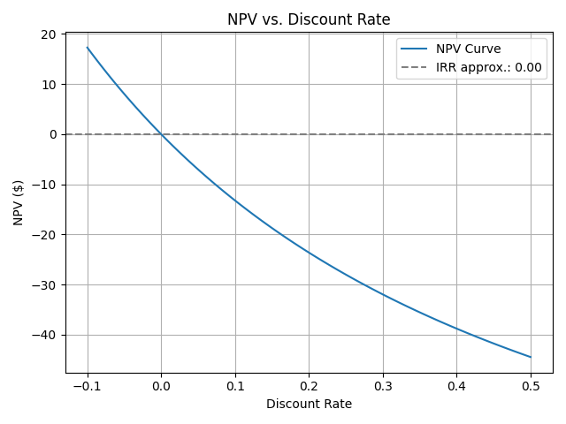

# Finance Core Library

This is a lightweight core finance library for computing and plotting common financial metrics like Net Present Value (NPV) and Internal Rate of Return (IRR). The goal is to build a solid foundation for financial computation with test coverage, modularity, and educational clarity.

## Features

- `getNPV(cashflows, discount_rate)`: Computes Net Present Value via formula
- `npf_getNPV(cashflows, discount_rate)`: Computes Net Present Value via numpy_financial
- `getIRR(cashflows)`: Estimates Internal Rate of Return via numpy_financial.
- `irr_bisection(cashflows, ...)`: Estimates Internal Rate of Return via bisection.
- `irr_newton_raphson(cashflows, ...)`: Estimates Internal Rate of Return via Newton-Raphson method.
- `plot_npv_curve(cashflow, ...)`: Plots NPV vs. Discount Rate with optional IRR annotation and save-to-file.
- Command-line interface with flags like `--rate_min`, `--save_path`, and `--return_irr`.
- Built for education, modularity, and public showcase (with full test coverage). 

## Structure

- `finance-core/`: Core logic for IRR, NPV, and more
  - `irr.py`: defines internal rate of return methods, one via numpy_finance, one via bisection. 
  - `npv.py`: defines net present value methods, one via formula calculation, one via numpy_finance.
  - `plot_npv.py`: defines npv plotting method.
- `tests/`: Unit tests for validating financial functions
  - `test_irr.py`: unittest for irr.py
  - `test_npv.py`: unittest for npv.py
  - `test_plot_npv.py`: unittest for plot_npv.py
- `docs/`: Project documentation and finance notes
  - `README.md`: this file.

## Getting Started
1. To set up dependency, use:  
 `pip install -r requirements.txt`

2. To run tests, use:  
 `python -m unittest tests/test_<module>.py`  
 or simply run all tests:  
 `python -m unittest discover tests`

3. To run functions, use:  
`python -m finance_core.<module> <input>`

## Usage

Run from the project root using the `-m` flag.

### Plotting NPV

python -m finance_core.plot_npv -100 50 30 40 --return_irr --save_path npv_plot.png

#### Arguments:  

- `<cashflows>` (required): A list of cashflows, e.g. -1000 500 400  
- `--rate_min`: Minimum discount rate to plot (default: -0.5)  
- `--rate_max`: Maximum discount rate to plot (default: 0.5)  
- `--steps`: Number of steps to evaluate NPV curve (default: 100)  
- `--return_irr`: Print estimated IRR  
- `--save_path`: Save plot to file instead of displaying  
- `--compare`: Plot a secondary curve with a differents set of cashflow to compare with.

  
  

### Running IRR Calculation

python -m finance_core.irr "-1000,300,500,200"

### Running NPV Calculation

python -m finance_core.npv -100 50 30 40 15%

## Author
Laura Nan - Work in Progress. 
This project is part of a structured self-study journey toward Quantitative & Computational Finance. It emphasizes mastery through implementation, testing, and real-world modeling scenarios.
